# Actividad 10: BDD con Behave y Gherkin

En esta actividad, se ha implementado el desarrollo impulsado por comportamiento (Behavior-Driven Development, BDD) utilizando **Behave** y **Gherkin**. El objetivo principal fue alinear los requerimientos del sistema con los escenarios de prueba basados en las historias de usuario. En este proyecto, se implementó la simulación de comer pepinos y esperar un tiempo específico para verificar si el estómago del usuario gruñe, lo cual se ha expresado mediante historias de usuario y criterios de aceptación.


# Índice del proyecto
## 1. Introducción
- [1.1 Contexto del Proyecto](#contexto-del-proyecto)
- [1.2 Relación BDD, Behave, Gherkin, Historias de Usuario y Criterios de Aceptación](#relación-bdd-behave-gherkin-historias-de-usuario-y-criterios-de-aceptación)
- [1.3 Historias de Usuario y Criterios de Aceptación](#historias-de-usuario-y-criterios-de-aceptación)

## 2. Resolución de los Ejercicios Propuestos
- [2.1 Ejercicio 1: Añadir soporte para minutos y segundos en tiempos de espera](#ejercicio-1-añadir-soporte-para-minutos-y-segundos-en-tiempos-de-espera)
- [2.2 Ejercicio 2: Manejo de cantidades fraccionarias de pepinos](#ejercicio-2-manejo-de-cantidades-fraccionarias-de-pepinos)
- [2.3 Ejercicio 3: Soporte para idiomas múltiples](#ejercicio-3-soporte-para-idiomas-múltiples)
- [2.4 Ejercicio 4: Manejo de cantidades aleatorias de tiempo](#ejercicio-4-manejo-de-cantidades-aleatorias-de-tiempo)
- [2.5 Ejercicio 5: Validación de cantidades no válidas](#ejercicio-5-validación-de-cantidades-no-válidas)
- [2.6 Ejercicio 6: Escalabilidad con grandes cantidades de pepinos](#ejercicio-6-escalabilidad-con-grandes-cantidades-de-pepinos)
- [2.7 Ejercicio 7: Descripciones de tiempo complejas](#ejercicio-7-descripciones-de-tiempo-complejas)
- [2.8 Ejercicio 8: De TDD a BDD – Convertir requisitos técnicos a pruebas en Gherkin](#ejercicio-8-de-tdd-a-bdd--convertir-requisitos-técnicos-a-pruebas-en-gherkin)
- [2.9 Ejercicio 9: Identificación de criterios de aceptación para historias de usuario](#ejercicio-9-identificación-de-criterios-de-aceptación-para-historias-de-usuario)
- [2.10 Ejercicio 10: Escribir pruebas unitarias antes de escenarios BDD](#ejercicio-10-escribir-pruebas-unitarias-antes-de-escenarios-bdd)
- [2.11 Ejercicio 11: Refactorización guiada por TDD y BDD](#ejercicio-11-refactorización-guiada-por-tdd-y-bdd)
- [2.12 Ejercicio 12: Ciclo completo de TDD a BDD – añadir nueva funcionalidad](#ejercicio-12-ciclo-completo-de-tdd-a-bdd--añadir-nueva-funcionalidad)
- [2.13 Ejercicio 13: Añadir criterios de aceptación claros](#ejercicio-13-añadir-criterios-de-aceptación-claros)

## Contexto del Proyecto

El proyecto denominado **belly_project** se enfoca en la creación de pruebas BDD para un escenario en el que una clase `Belly` simula la ingesta de pepinos y la espera de un tiempo determinado para verificar si el estómago gruñe. El sistema está probado utilizando escenarios escritos en el lenguaje Gherkin, permitiendo que todas las partes involucradas (stakeholders, desarrolladores, testers) comprendan el comportamiento esperado.

## Relación BDD, Behave, Gherkin, Historias de Usuario y Criterios de Aceptación

- **Behavior-Driven Development (BDD)**:  
  - BDD es una técnica de desarrollo que promueve la colaboración entre desarrolladores, testers y stakeholders, utilizando un lenguaje accesible para todos.  
  - En este proyecto, se utiliza para describir el comportamiento esperado de la clase `Belly`, que se basa en la cantidad de pepinos consumidos y el tiempo de espera.

- **Gherkin**:  
  - Gherkin es el lenguaje utilizado para describir los escenarios de prueba en Behave. Su estructura sigue el formato **Dado**, **Cuando**, **Entonces**.  
  - Ejemplo:  
    - **Dado** que he comido 42 pepinos,  
    - **Cuando** espero 2 horas,  
    - **Entonces** mi estómago debería gruñir.

- **Behave**:  
  - Behave es una herramienta de Python que permite ejecutar pruebas escritas en Gherkin. Las pruebas descritas en Gherkin se vinculan con código Python mediante pasos definidos en los archivos `steps.py`. Behave toma las definiciones de los escenarios Gherkin y las convierte en pruebas ejecutables, asegurando que el sistema cumple con los criterios de aceptación definidos en las historias de usuario.
  - En este proyecto, cada escenario de Gherkin está implementado en `belly_steps.py`, donde se definen los pasos necesarios para simular el acto de comer pepinos y esperar. Por ejemplo, un paso como **Cuando espero 2 horas** está relacionado con una función en Python que calcula el tiempo de espera y decide si el estómago debería gruñir.

- **Historias de Usuario**
  - Las historias de usuario describen funcionalidades desde el punto de vista del usuario y expresan lo que el sistema debe hacer de manera sencilla y clara. En el proyecto, cada historia de usuario especifica una acción (como comer pepinos) y un objetivo (como saber si el estómago gruñe).

- **Criterios de Aceptación**
  - Los criterios de aceptación son reglas que describen las condiciones bajo las cuales la funcionalidad de la historia de usuario se considera completada. Estos criterios se implementan a través de escenarios de prueba en Gherkin.

## Historias de Usuario y Criterios de Aceptación

A continuación se presentan algunas de las historias de usuario implementadas:

### Historia de Usuario 1: Comer muchos pepinos y esperar el tiempo suficiente
- **Como** una persona que ha comido una cantidad considerable de pepinos,  
- **Quiero** que mi estómago comience a gruñir después de esperar al menos 2 horas,  
- **Para** saber si he comido lo suficiente para sentirme lleno.

**Criterios de aceptación**:  
- **Dado** que he comido más de 10 pepinos,  
- **Cuando** espero al menos 2 horas,  
- **Entonces** mi estómago debería gruñir.

### Historia de Usuario 2: Comer pocos pepinos y no gruñir
- **Como** una persona que ha comido una pequeña cantidad de pepinos,  
- **Quiero** que mi estómago no gruña si no he comido lo suficiente,  
- **Para** saber que aún no he comido lo necesario para sentirme lleno.

**Criterios de aceptación**:  
- **Dado** que he comido menos de 10 pepinos,  
- **Cuando** espero 2 horas,  
- **Entonces** mi estómago no debería gruñir.

---

## Resolución de los Ejercicios Propuestos

### Ejercicio 1: Añadir soporte para minutos y segundos en tiempos de espera
- **Objetivo**: Añadir soporte para tiempos de espera expresados en minutos y segundos al sistema.
- **Instrucciones**:
  - Modifica la función que maneja el tiempo de espera para que soporte minutos y segundos.
  - Asegúrate de que las entradas como "1 hora y 30 minutos", "90 minutos", y "3600 segundos" sean correctamente interpretadas.
  - Implementa un escenario de prueba en Gherkin que valide que el estómago gruñe o no según estas variaciones de tiempo.

#### Pasos que se realizaron:

1. Modificar la función que maneja tiempo para de espera para que soporte minutos y segundos.
```Python
@when('espero {time_description}')
def step_when_wait_time_description(context, time_description):
    time_description = time_description.strip('"').lower()
    time_description = time_description.replace('y', ' ')
    time_description = time_description.strip()

    # Manejar casos especiales como 'media hora'
    if time_description == 'media hora':
        total_time_in_hours = 0.5
    else:
        # Expresión regular para extraer horas, minutos y segundos
        pattern = re.compile(r'(?:(\w+)\s*horas?)?\s*(?:(\w+)\s*minutos?)?\s*(?:(\w+)\s*segundos?)?')
        match = pattern.match(time_description)

        if match:
            hours_word = match.group(1) or "0"
            minutes_word = match.group(2) or "0"
            seconds_word = match.group(3) or "0"

            hours = convertir_palabra_a_numero(hours_word)
            minutes = convertir_palabra_a_numero(minutes_word)
            seconds = convertir_palabra_a_numero(seconds_word)

            total_time_in_hours = hours + (minutes / 60) + (seconds / 3600)
        else:
            raise ValueError(f"No se pudo interpretar la descripción del tiempo: {time_description}")

    context.belly.esperar(total_time_in_hours)
```
2. Se agrega el escenario de prueba en Gherkin

```Gherkin
  Escenario: comer pepinos y esperar en minutos y segundos
    Dado que he comido 35 pepinos
    Cuando espero "1 hora y 30 minutos y 45 segundos"
    Entonces mi estómago debería gruñir
```

3. **Resultado del ejercicio**

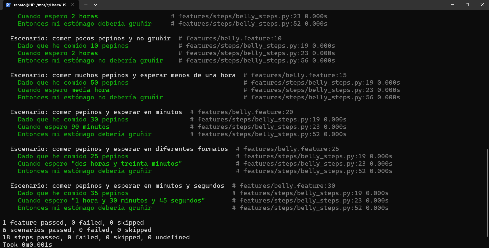

---

### Ejercicio 2: Manejo de cantidades fraccionarias de pepinos
- **Objetivo**: Permitir que el sistema acepte cantidades fraccionarias de pepinos.
- **Instrucciones**:
  - Modifica el sistema para que acepte entradas de pepinos en forma de números decimales, como "0.5" o "2.75".
  - Implementa un nuevo escenario en Gherkin donde se ingiera una cantidad fraccionaria de pepinos y se verifique el comportamiento del sistema.
  - Añade un manejo de excepciones para evitar que se ingrese una cantidad negativa de pepinos.

#### Pasos que se realizaron:

1. Modificar `belly_setps.py` para que acepte decimales.

```Python
@given('que he comido {cukes} pepinos')
def step_given_eaten_cukes(context, cukes):
    cukes = float(cukes)
    context.belly.comer(cukes)
```
2. Agregar manejo de excepciones para evitar que se ingrese una cantidad negativa 
de pepinos.

```Python
    def comer(self, pepinos):
        if pepinos <= 0:
            raise ValueError("La cantidad de pepinos debe ser positiva.")
        print(f"He comido {pepinos} pepinos.")
        self.pepinos_comidos += pepinos
```

3. Agregar escenario de prueba en Gherkin
```Gherkin
  Escenario: Comer una cantidad fraccionaria de pepinos
    Dado que he comido 0.5 pepinos
    Cuando espero 2 horas
    Entonces mi estómago no debería gruñir
``` 

4. **Resultado del ejercicio**

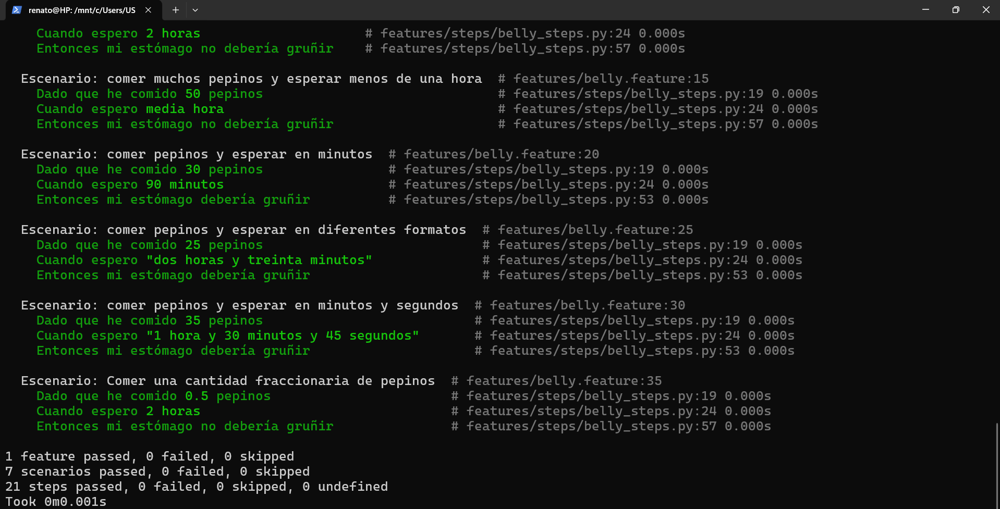

---

### Ejercicio 3: Soporte para idiomas múltiples
- **Objetivo**: Agregar soporte para manejar diferentes idiomas (inglés y español) en las descripciones de tiempo.
- **Instrucciones**:
  - Modifica el código para que acepte entradas de tiempo en inglés, además de español. Por ejemplo, "two hours" o "treinta minutos".
  - Escribe al menos dos escenarios de prueba que usen tiempos en inglés.
  - Implementa una función que convierta las palabras en inglés a valores numéricos.

#### Pasos que se realizaron:

1. Modificar `belly_setps.py` para que acepte el idioma inglés. Por tal razón, se modifica la función `convertir_palabra_a_numero`:

```Python
def convertir_palabra_a_numero(palabra):
    try:
        return int(palabra)
    except ValueError:
        numeros = {
            #Números en español
            "cero": 0, "uno": 1, "una":1, "dos": 2, "tres": 3, "cuatro": 4, "cinco": 5,
            "seis": 6, "siete": 7, "ocho": 8, "nueve": 9, "diez": 10, "once": 11,
            "doce": 12, "trece": 13, "catorce": 14, "quince": 15, "dieciséis": 16,
            "diecisiete":17, "dieciocho":18, "diecinueve":19, "veinte":20,
            "treinta": 30, "cuarenta":40, "cincuenta":50, "sesenta":60, "setenta":70,
            "ochenta":80, "noventa":90, "media": 0.5,

            #Números en inglés
            "zero": 0, "one": 1, "two": 2, "three": 3, "four": 4, "five": 5,
            "six": 6, "seven": 7, "eight": 8, "nine": 9, "ten": 10, "eleven": 11,
            "twelve": 12, "thirteen": 13, "fourteen": 14, "fifteen": 15, "sixteen": 16,
            "seventeen": 17, "eighteen": 18, "nineteen": 19, "twenty": 20,
            "thirty": 30, "forty": 40, "fifty": 50, "sixty": 60, "seventy": 70,
            "eighty": 80, "ninety": 90, "half": 0.5
        }
        return numeros.get(palabra.lower(), 0)
```
2. También se modificó la función que maneja el tiempo.

```Python
def step_when_wait_time_description(context, time_description):
    time_description = time_description.strip('"').lower()
    time_description = time_description.replace('y', ' ').replace('and', ' ')
    time_description = time_description.strip()

    # Manejar casos especiales como 'media hora' o 'half hour'
    if time_description in ['media hora', 'half hour']:
        total_time_in_hours = 0.5
    else:
        # Expresión regular para extraer horas y minutos en español e inglés
        pattern = re.compile(r'(?:(\w+)\s*(?:horas?|hours?))?\s*(?:(\w+)\s*(?:minutos?|minutes?))?\s*(?:(\w+)\s*(?:segundos?|seconds?))?')
        match = pattern.fullmatch(time_description)

        if match:
            hours_word = match.group(1) or "0"
            minutes_word = match.group(2) or "0"
            seconds_word = match.group(3) or "0"

            hours = convertir_palabra_a_numero(hours_word)
            minutes = convertir_palabra_a_numero(minutes_word)
            seconds = convertir_palabra_a_numero(seconds_word)

            total_time_in_hours = hours + (minutes / 60) + (seconds / 3600)
        else:
            raise ValueError(f"No se pudo interpretar la descripción del tiempo: {time_description}")

    context.belly.esperar(total_time_in_hours)
```
3. Se agregan los escenarios de prueba en Gherkin.
```Gherkin
  Escenario: Esperar usando horas en inglés
    Dado que he comido 20 pepinos
    Cuando espero "two hours and thirty minutes"
    Entonces mi estómago debería gruñir

  Escenario: Esperar usando minutos en inglés
    Dado que he comido 40 pepinos
    Cuando espero "4 hours"
    Entonces mi estómago debería gruñir
```
4. **Resultado del ejercicio**

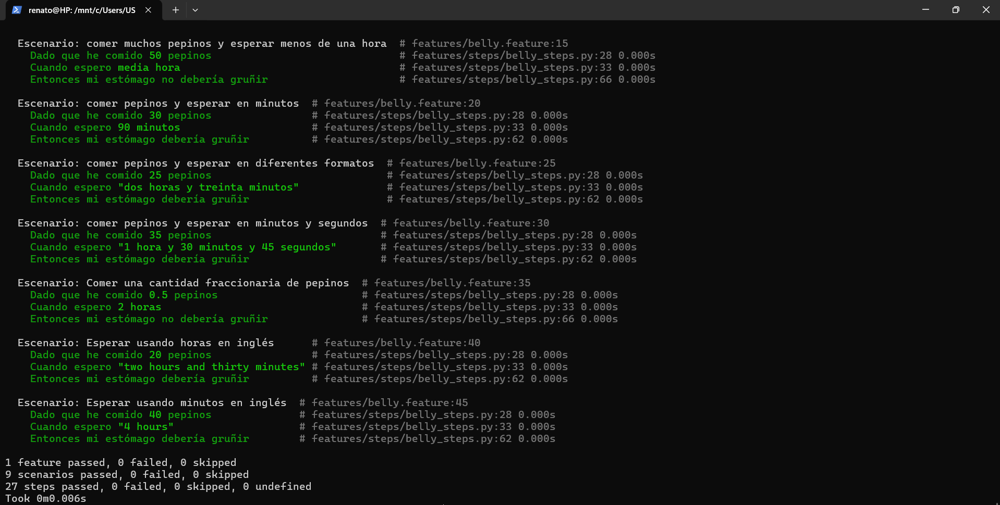

---

### Ejercicio 4: Manejo de cantidades aleatorias de tiempo
- **Objetivo**: Añadir la capacidad de manejar tiempos aleatorios en un rango específico.
- **Instrucciones**:
  - Crea una nueva función que permita ingresar un rango de tiempo (por ejemplo, entre 1 y 3 horas) y elija un tiempo aleatorio dentro de ese rango.
  - Implementa un escenario de prueba en Gherkin donde se verifique que el estómago gruñe tras un tiempo aleatorio.
  - Imprime el tiempo aleatorio generado en el paso de la prueba.

#### Pasos que se realizaron:

1. Se creó la nueva función que permite ingresar un rango de tiempo (por ejemplo, entre 1 y 3 horas).

```Python
@when('espero un tiempo aleatorio entre {min_time} y {max_time} horas')
def step_when_wait_random_time(context, min_time, max_time):
    # Convertimos los tiempos mínimos y máximos
    min_time = float(min_time)
    max_time = float(max_time)

    # Generamos un tiempo aleatorio entre el mínimo y el máximo
    random_time = random.uniform(min_time, max_time)
    print(f"\033[96mTiempo aleatorio generado: {random_time:.2f} horas\033[0m")

    # Esperamos ese tiempo
    context.belly.esperar(random_time)
```
2. Se agrega el escenario de prueba en Gherkin donde se verifique que el estómago gruñe tras un tiempo aleatorio.

```Gherkin
  Escenario: Comer pepinos y esperar un tiempo aleatorio
    Dado que he comido 25 pepinos
    Cuando espero un tiempo aleatorio entre 1 y 3 horas
    Entonces mi estómago debería gruñir
```

3. **Resultado del ejercicio cuando falla**
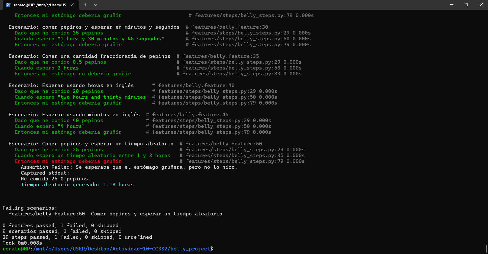
4. **Resultado del ejercicio cuando sale todo bien**
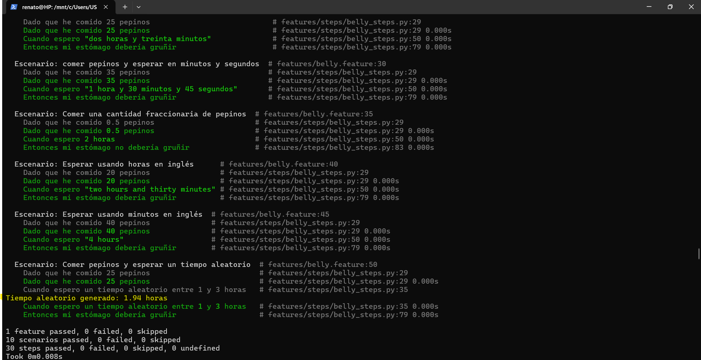
---

### Ejercicio 5: Validación de cantidades no válidas
- **Objetivo**: Manejar casos en los que se ingresen cantidades no válidas de pepinos.
- **Instrucciones**:
  - Añade validaciones para evitar que el usuario ingrese una cantidad negativa o extremadamente alta de pepinos.
  - Modifica la lógica para arrojar un error si se ingresa una cantidad de pepinos superior a 100 o menor que 0.
  - Implementa un escenario de prueba en Gherkin para verificar el manejo correcto de errores.

#### Pasos que se realizaron:

1. Modificar método `comer` en `belly.py` para evitar que el usuario ingrese una cantidad negativa o extremadamente alta de pepinos
```Python
    def comer(self, pepinos):
        # Validar que la cantidad sea mayor que 0 y menor o igual a 100
        if pepinos <= 0:
            raise ValueError("La cantidad de pepinos debe ser positiva.")
        if pepinos > 100:
            raise ValueError("No puedes comer más de 100 pepinos a la vez.")
        
        print(f"He comido {pepinos} pepinos.")
        self.pepinos_comidos += pepinos
```
2. Actualizar `belly_steps.py` para manejar los errores de la prueba

```Python
@given('que he comido {cukes} pepinos')
def step_given_eaten_cukes(context, cukes):
    try:
        cukes = float(cukes)
        context.belly.comer(cukes)
    except ValueError as e:
        context.error_message = str(e)

@then('debería ocurrir un error de cantidad negativa')
def step_then_should_raise_error(context):
    assert context.error_message == "La cantidad de pepinos debe ser positiva.", f"Error esperado no ocurrió, mensaje recibido: {context.error_message}"

@then('debería ocurrir un error de cantidad extremadamente alta')
def step_then_should_raise_high_error(context):
    assert context.error_message == "No puedes comer más de 100 pepinos a la vez.", f"Error esperado no ocurrió, mensaje recibido: {context.error_message}"
```
3. Agregar escenarios de prueba en Gherkin para verificar el manejo correcto de errores

```Gherkin
Escenario: Manejar una cantidad no válida de pepinos (cantidad negativa)
  Dado que he comido -5 pepinos
  Entonces debería ocurrir un error de cantidad negativa

Escenario: Manejar una cantidad no válida de pepinos (cantidad extremadamente alta)
  Dado que he comido 150 pepinos
  Entonces debería ocurrir un error de cantidad extremadamente alta

```
4. **Resultado del ejercicio**
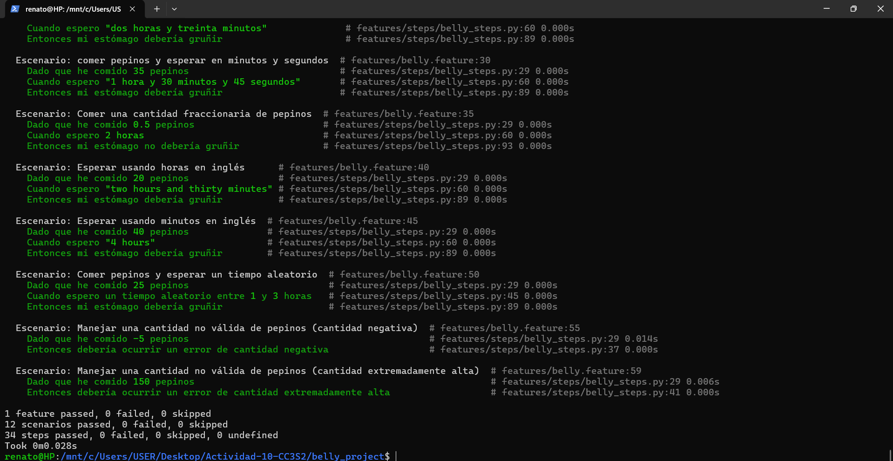
---

### Ejercicio 6: Escalabilidad con grandes cantidades de pepinos
- **Objetivo**: Verificar el comportamiento del sistema cuando se ingieren grandes cantidades de pepinos y se espera durante periodos largos.
- **Instrucciones**:
  - Añade soporte para manejar cantidades muy grandes de pepinos, como 1000.
  - Implementa escenarios de prueba donde se espera un tiempo largo, como 10 horas, tras comer una gran cantidad de pepinos.
  - Valida que el sistema sigue funcionando correctamente sin errores o lentitud.

#### Pasos que se realizaron:

1. Primero comentamos la condición en la cual no se permitía ingresar más de 100 pepinos. Para eso nos dirigimos a `belly.py` 
```Python
    def comer(self, pepinos):
        # Ahora permitimos grandes cantidades, como 1000 pepinos
        if pepinos <= 0:
            raise ValueError("La cantidad de pepinos debe ser positiva.")
        #if pepinos > 100:
        #    raise ValueError("No puedes comer más de 100 pepinos a la vez.")
        
        print(f"He comido {pepinos} pepinos.")
        self.pepinos_comidos += pepinos
```
2. Luego en `belly_steps.py`, realizamos este cambio en este bloque de código:
```Python
def step_when_wait_time_description(context, time_description):
    try:
        # Intentamos convertir el tiempo directamente si es un número simple como "10 hours"
        total_time_in_hours = float(time_description)
    except ValueError:
        # Si no es un número simple, aplicamos la lógica actual
        time_description = time_description.strip('"').lower()
        time_description = time_description.replace('y', ' ').replace('and', ' ')
        time_description = time_description.strip()
```
3. Agregamos el escenario de prueba donde se espera un tiempo largo, como 10 horas, tras comer una gran cantidad de pepinos.

```Gherkin
@grandes-cantidades
  Escenario: Comer 1000 pepinos y esperar 10 horas
    Dado que he comido 1000 pepinos
    Cuando espero 10 horas
    Entonces mi estómago debería gruñir
```
4. Se observa una etiqueta llamada `grandes-cantidades`, esto nos servirá para ejecutar únicamente un escenario específico en `behave`.
5. Se ejecuta con el siguiente comando: `behave -t @grandes-cantidades`. 
6. **Resultado del ejercicio**
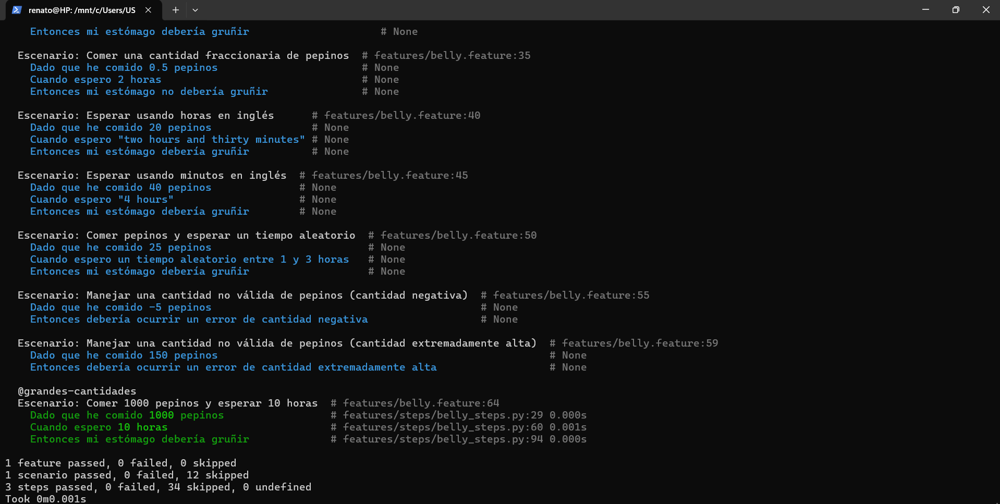
---

### Ejercicio 7: Descripciones de tiempo complejas
- **Objetivo**: Ampliar la lógica para manejar descripciones de tiempo complejas.
- **Instrucciones**:
  - Modifica la expresión regular que analiza las descripciones de tiempo para que soporte combinaciones más complejas como "1 hora, 30 minutos y 45 segundos".
  - Implementa escenarios en Gherkin que validen estos casos.
  - Asegúrate de que el sistema calcule correctamente el tiempo total en horas.
#### Pasos que se realizaron:

1. En la función `step_when_wait_time_description` en `belly_steps.py` modificamos la siguiente línea para eliminar las comas (,) del texto en `time_description`.
```Python
time_description = time_description.replace('y', ' ').replace('and', ' ').replace(',', '')
```
2. Luego modificamos la expresión regular para capturar horas, minutos y segundos de manera opcional
```Python
r'(?:(\d+)\s*(?:hora[s]?|hour[s]?))?\s*(?:(\d+)\s*(?:minuto[s]?|minute[s]?))?\s*(?:(\d+)\s*(?:segundo[s]?|second[s]?))?'
```
Esto permite descripciones como:

- **"1 hora, 30 minutos y 45 segundos"**
- **"2 horas y 15 minutos"**
- **"45 segundos"**
- **Etc.**
3. Se agrega el escenario con su etiqueta. Y para comprobar se ejecuta el comando: `behave -t @complejos`
```Gherkin
@complejos
  Escenario: Manejar tiempos complejos
    Dado que he comido 50 pepinos
    Cuando espero "1 hora, 30 minutos y 45 segundos"
    Entonces mi estómago debería gruñir
```
3. **Resultado del ejercicio**
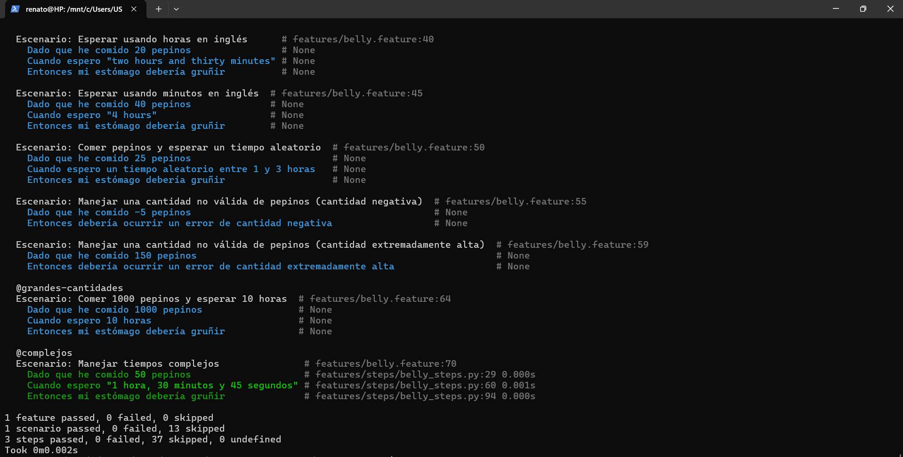
---

### Ejercicio 8: De TDD a BDD – Convertir requisitos técnicos a pruebas en Gherkin
- **Objetivo**: Partir de un test unitario (en TDD) y luego convertirlo en un escenario BDD que sea comprensible por el negocio.
- **Instrucciones**:
  - Escribe un test unitario básico utilizando un framework como pytest para verificar que si el usuario ha comido más de 10 pepinos, el estómago debería gruñir.
  - Luego, convierte este test unitario en un escenario en Gherkin que represente el comportamiento desde la perspectiva del usuario.
  - Implementa los pasos necesarios en Behave para ejecutar el escenario.

#### Pasos que se realizaron:

1. Se crea una carpeta `tests` para las pruebas unitarias. Y creamos el archivo `test_belly.py`.
```Python
import sys
import os
sys.path.insert(0, os.path.abspath(os.path.join(os.path.dirname(__file__), '../src')))
from belly import Belly

def test_grunir_si_comido_muchos_pepinos():
    belly = Belly()
    belly.comer(15)
    belly.esperar(2)
    assert belly.esta_gruñendo() == True
```
2. Se agrega el escenario para este ejercicio.
```Gherkin
@ejercicio_8
Escenario: Comer muchos pepinos y esperar el tiempo suficiente
   Dado que he comido 15 pepinos
   Cuando espero 2 horas
   Entonces mi estómago debería gruñir
```
3. **Resultado de la prueba unitaria**
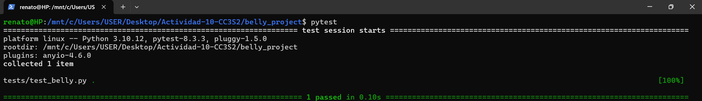
4. **Resultado del ejercicio con behave**
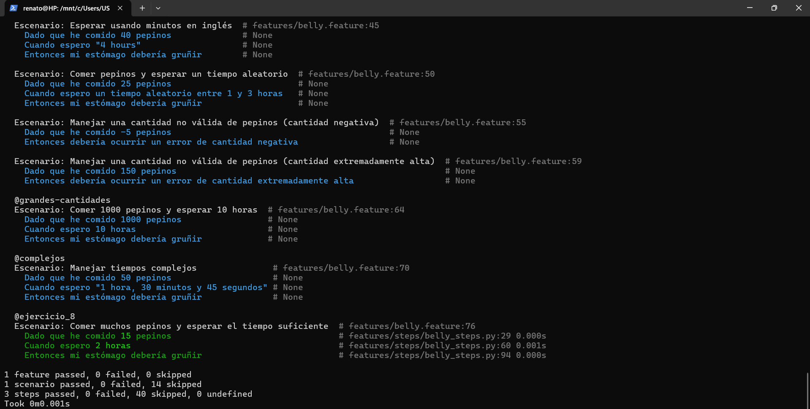
---

### Ejercicio 9: Identificación de criterios de aceptación para historias de usuario
- **Objetivo**: A partir de una historia de usuario dada, identificar los criterios de aceptación y traducirlos a escenarios BDD.
- **Instrucciones**:
  - Proporciona una historia de usuario como "Como usuario, quiero saber si mi estómago gruñe cuando he comido suficientes pepinos y he esperado suficiente tiempo".
  - Identifica los criterios de aceptación clave (por ejemplo, cantidad de pepinos y tiempo de espera).
  - Escribe escenarios en Gherkin que cubran estos criterios.
  - Implementa los pasos en Behave y relaciona estos escenarios con la lógica del sistema.

#### Pasos que se realizaron:

1. Se agregan los escenarios de prueba en Gherkin basados en los criterios de aceptación.
```Gherkin
  @critico
  Escenario: Comer suficientes pepinos y esperar el tiempo adecuado
    Dado que he comido 20 pepinos
    Cuando espero 2 horas
    Entonces mi estómago debería gruñir

  @critico
  Escenario: Comer pocos pepinos y no esperar suficiente tiempo
    Dado que he comido 5 pepinos
    Cuando espero 1 hora
    Entonces mi estómago no debería gruñir
```
2. Para ejecutar: `behave -t @critico`.
3. **Resultado del ejercicio**
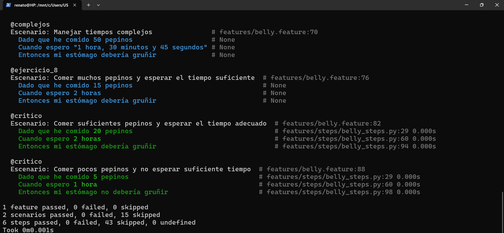
---

### Ejercicio 10: Escribir pruebas unitarias antes de escenarios BDD
- **Objetivo**: Utilizar TDD para escribir primero una prueba unitaria de una funcionalidad y luego expandirla en un escenario BDD.
- **Instrucciones**:
  - Escribe un test unitario para una nueva función que calcule el número de pepinos restantes tras comer una cierta cantidad.
  - Después, crea un escenario de BDD en Gherkin que describa este comportamiento desde el punto de vista del usuario.
  - Implementa tanto la prueba unitaria como el escenario BDD en Behave.

#### Pasos que se realizaron:
1. Agregamos la función `pepinos_restantes` en `belly.py`.
```Python
def pepinos_restantes(self, total_pepinos):
        # Calcula cuántos pepinos quedan después de comer
        return total_pepinos - self.pepinos_comidos
```
2. Se agrega nueva prueba en `test_belly.py`.
```Python
def test_pepinos_restantes():
    belly = Belly()
    belly.comer(15)
    assert belly.pepinos_restantes(20) == 5, "Se esperaban 5 pepinos restantes."
```
3. Agregamos el escenario de prueba en Gherkin
```Gherkin
@pepinos-restantes
Escenario: Saber cuántos pepinos he comido y cuántos quedan
  Dado que he comido 15 pepinos
  Y tengo un total de 20 pepinos
  Entonces deberían quedar 5 pepinos
```
4. En `belly_steps.py` agregamos implementamos los nuevos pasos para el escenario de este ejercicio.
```Python
@given('tengo un total de {total_pepinos} pepinos')
def step_given_total_cukes(context, total_pepinos):
    context.total_pepinos = float(total_pepinos)

@then('deberían quedar {expected_restantes} pepinos')
def step_then_should_have_remaining_cukes(context, expected_restantes):
    expected_restantes = float(expected_restantes)
    restantes = context.belly.pepinos_restantes(context.total_pepinos)
    assert restantes == expected_restantes, f"Se esperaban {expected_restantes} pepinos restantes, pero quedan {restantes}."
```
5. **Ejecutar las pruebas**
- Para ejecutar la prueba unitaria (TDD):
  ```bash
  pytest tests/
  ```
- Y para ejecutar el escenario BDD:

  ```bash
  behave -t @pepinos-restantes
  ```
6. **Resultado de la prueba unitaria**

7. **Resultado del ejercicio con behave**
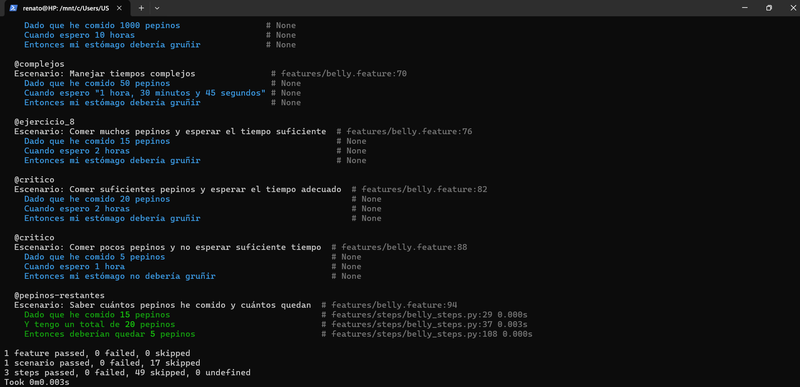
---

### Ejercicio 11: Refactorización guiada por TDD y BDD
- **Objetivo**: Refactorizar una parte del código existente utilizando TDD y luego escribir escenarios en BDD para asegurarse de que el sistema siga comportándose correctamente.
- **Instrucciones**:
  - Escribe una prueba unitaria para una funcionalidad ya existente, como la función que verifica si el estómago debería gruñir.
  - Refactoriza el código para mejorar la eficiencia o la legibilidad, asegurándote de que las pruebas unitarias aún pasen.
  - Luego, escribe escenarios en Gherkin para validar que el comportamiento del sistema no ha cambiado desde la perspectiva del usuario.

#### Pasos que se realizaron:
1. Agregar prueba unitaria `test_estomago_gruñendo`.
```Python
def test_estomago_gruñendo():
    belly = Belly()
    belly.comer(20)
    belly.esperar(2)
    assert belly.esta_gruñendo() == True, "Se esperaba que el estómago gruñera, pero no lo hizo."
```
2. Agregar escenario de prueba para este ejercicio.
```Gherkin
@estomago-gruñendo
Escenario: Verificar que el estómago gruñe después de comer suficientes pepinos y esperar el tiempo correcto
  Dado que he comido 20 pepinos
  Cuando espero 2 horas
  Entonces mi estómago debería gruñir

```
3. **Ejecutar las pruebas**
- Para ejecutar la prueba unitaria (TDD):
  ```bash
  pytest tests/
  ```
- Y para ejecutar el escenario BDD:

  ```bash
  behave -t @estomago-gruñendo
  ```
4. **Resultado de la prueba unitaria**
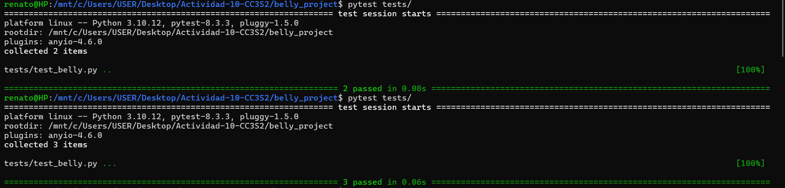
5. **Resultado del ejercicio con behave**
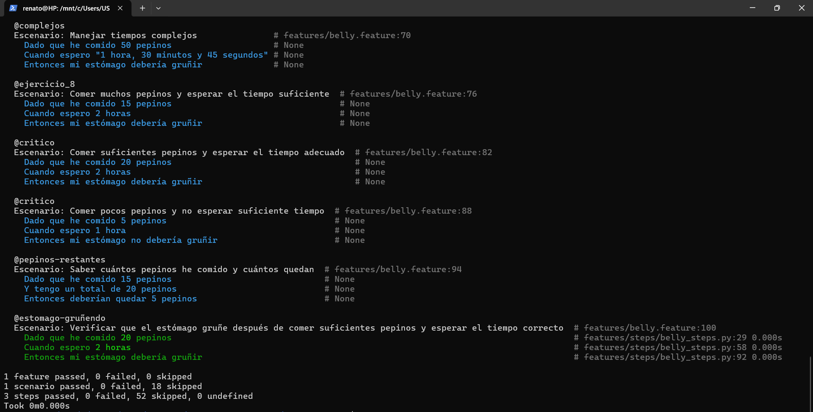
---

### Ejercicio 12: Ciclo completo de TDD a BDD – Añadir nueva funcionalidad
- **Objetivo**: Implementar una nueva funcionalidad desde cero utilizando TDD y BDD.
- **Instrucciones**:
  - Imagina una nueva funcionalidad que permita al usuario saber si su estómago gruñirá en función de la cantidad de pepinos y el tiempo de espera.
  - Escribe primero una prueba unitaria para esta funcionalidad.
  - Luego, convierte los requisitos de la funcionalidad en una historia de usuario con criterios de aceptación y escribe un escenario en Gherkin.
  - Implementa los pasos de Behave y asegúrate de que tanto la prueba unitaria como el escenario BDD pasen.
  - **Historia de usuario**: 
    - Como usuario, quiero saber si mi estómago gruñirá en base a una cantidad específica de pepinos y el tiempo que he esperado.

#### Pasos que se realizaron:
1. Se crea la prueba unitaria (TDD) `test_estomago_predecir_gruñido` en `test_belly.py`.
```Python
def test_estomago_predecir_gruñido():
    belly = Belly()
    belly.comer(12)
    belly.esperar(1.5)
    assert belly.esta_gruñendo() == True
```
2. Agregar escenario para este ejercicio.
```Gherkin
@prediccion_gruñido
Escenario: Predecir si mi estómago gruñirá tras comer y esperar
  Dado que he comido 12 pepinos
  Cuando espero 1.5 horas
  Entonces mi estómago debería gruñir
```
3.**Ejecutar las pruebas**
- Para ejecutar la prueba unitaria (TDD):
  ```bash
  pytest tests/
  ```
- Y para ejecutar el escenario BDD:

  ```bash
  behave -t @prediccion_gruñido
  ```
4. **Resultado de la prueba unitaria**
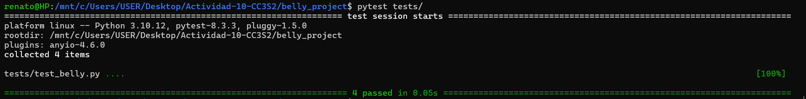
5. **Resultado del ejercicio con behave**
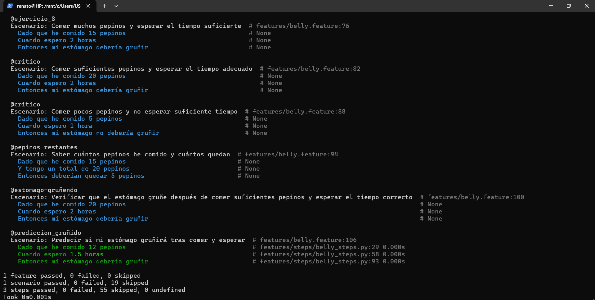
---

### Ejercicio 13: Añadir criterios de aceptación claros
- **Objetivo**: A partir de una funcionalidad nueva, crear criterios de aceptación claros y convertirlos en escenarios BDD.
- **Instrucciones**:
  - Imagina una nueva funcionalidad (por ejemplo, permitir que el usuario vea cuántos pepinos puede comer antes de que su estómago gruña).
  - Define criterios de aceptación claros basados en esta funcionalidad.
  - Convierte esos criterios en escenarios Gherkin.
  - Implementa los pasos en Behave para validar que el sistema cumple con esos criterios.
  - **Ejemplo de historia de usuario**:
    - Como usuario, quiero saber cuántos pepinos puedo comer antes de que mi estómago comience a gruñir.

#### Pasos que se realizaron:
1. Se agrega la función en `belly.py`.
```Python
def pepinos_mas_puedo_comer(self):
        # Si el estómago está gruñendo, no se pueden comer más pepinos
        if self.esta_gruñendo():
            return 0
        # Si no ha comido más de 10 pepinos, calcula cuántos faltan para llegar a 10
        return max(0, 10 - self.pepinos_comidos)
```
2. Se implementan los nuevos pasos en ``belly_steps.py`.
```Python
@when('pregunto cuántos pepinos más puedo comer')
def step_when_ask_how_many_more_cukes(context):
    context.pepinos_mas = context.belly.pepinos_mas_puedo_comer()

@then('debería decirme que puedo comer {expected_pepinos_mas} pepinos más')
def step_then_should_tell_how_many_more(context, expected_pepinos_mas):
    expected_pepinos_mas = int(expected_pepinos_mas)
    assert context.pepinos_mas == expected_pepinos_mas, f"Se esperaban {expected_pepinos_mas} pepinos más, pero el sistema dijo {context.pepinos_mas}."
```
3. Agregar escenario para este ejercicio.
```Gherkin
@comer_mas
Escenario: Ver cuántos pepinos puedo comer antes de que el estómago gruñe
  Dado que he comido 8 pepinos
  Cuando pregunto cuántos pepinos más puedo comer
  Entonces debería decirme que puedo comer 2 pepinos más

```
4. Para ejecutar: `behave -t @comer_mas`.
5. **Resultado del ejercicio**
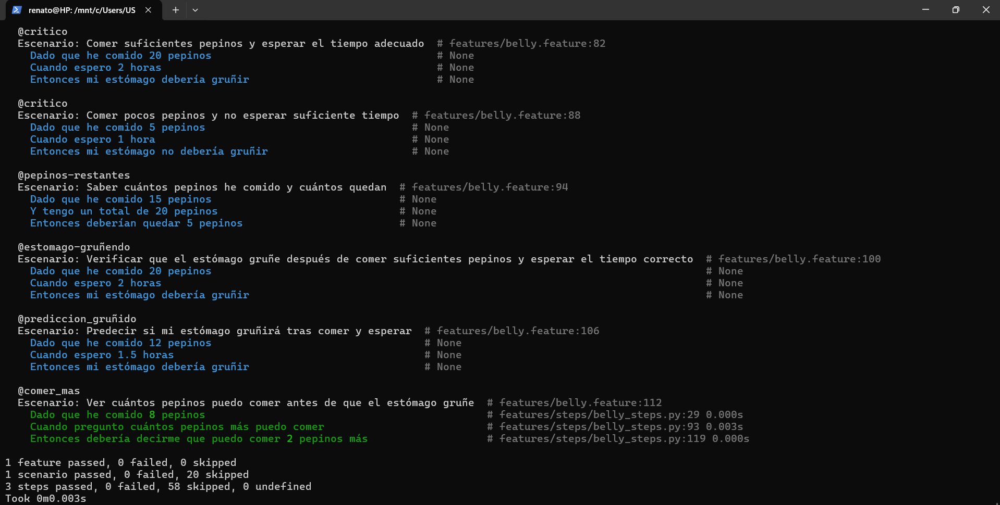
---


